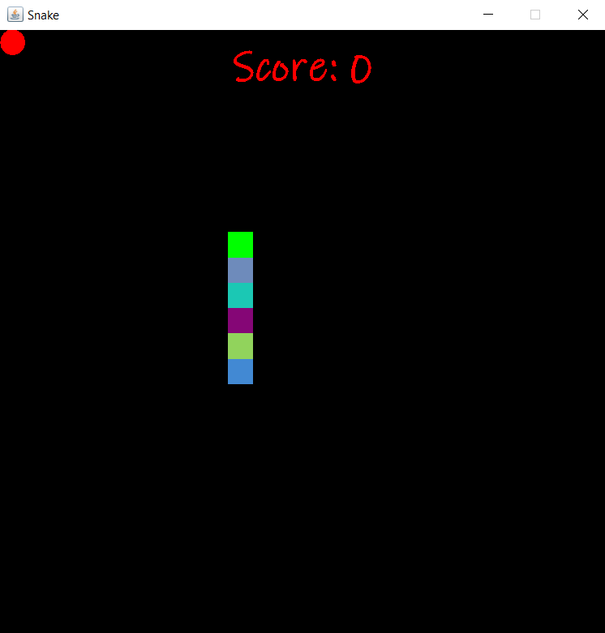
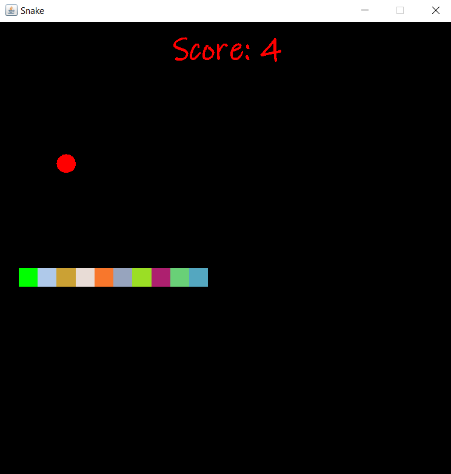
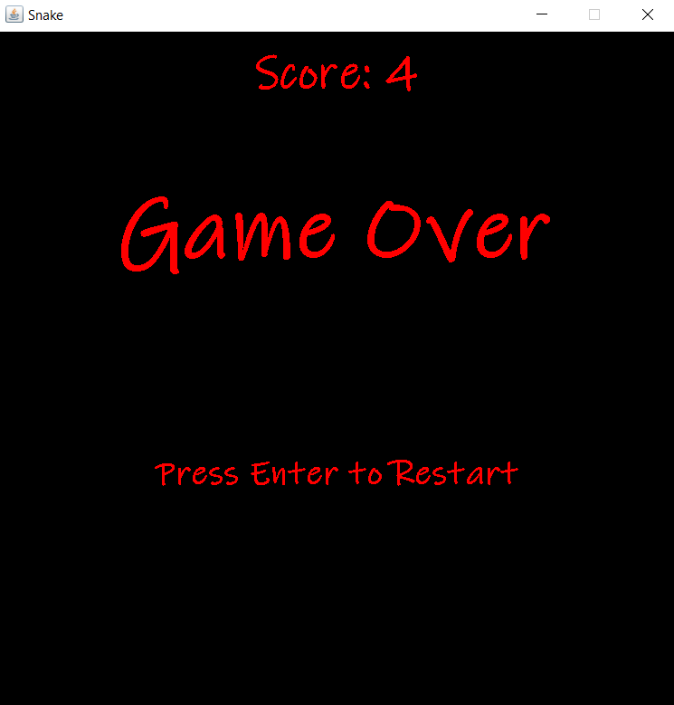

# 🐍 Snake Game (Java)

This is a simple and fun version of the classic Snake game developed using Java Swing. The game is controlled with arrow keys and includes a basic scoring system.

## 🎮 Screenshot

> The game screen displays the snake, food (apples), and current score at the top.

<p float="left">
  
  
  
</p>


## 🚀 Getting Started

### Requirements

- Java JDK 8 or later
- Any Java IDE (e.g., IntelliJ IDEA, Eclipse, VS Code) or terminal
- `javac` and `java` must be available in your system PATH

### Compile and Run

#### 1. Compile

```bash
javac -d bin src/SnakePackage/*.java
```

#### 2. Run

```bash
java -cp bin SnakePackage.SnakeGame
```

### 🖥️ Alternative: Run the `.exe` File

You can run the game directly on Windows using the included `Snake.exe` file.  
Use `Snake_Setup.exe` (created with Inno Setup) to install the game.

---

## 🎮 Game Rules

- You start as a snake with 6 body parts.
- Red circles represent apples.
- Every time you eat an apple:
  - The snake grows longer
  - Your score increases
- The game ends if you hit the wall or collide with your own body.
- After a game over, press `Enter` to restart.

## ⌨️ Controls

| Key        | Action          |
|------------|-----------------|
| ⬅️ Left     | Move left       |
| ➡️ Right    | Move right      |
| ⬆️ Up       | Move up         |
| ⬇️ Down     | Move down       |
| ⏎ Enter    | Restart the game|

---

## 📁 Project Structure

```
SnakeProject/
├── src/
│   └── SnakePackage/
│       ├── SnakeGame.java
│       ├── GameFrame.java
│       └── GamePanel.java
├── bin/                     # Compiled classes (via javac -d)
├── screenshot.png           # Game screenshot (optional)
├── Snake.exe                # Executable file (from Inno Setup)
├── Snake_Setup.exe          # Installer (optional)
└── README.md
```

## 🛠️ Technologies Used

- Java 8+
- Java Swing (for GUI)
- Inno Setup (for Windows installer)

## 📄 License

This project is licensed under the MIT License – see the [LICENSE](LICENSE) file for details.

---

**Enjoy the game! 🕹️**
